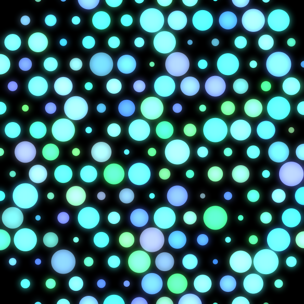
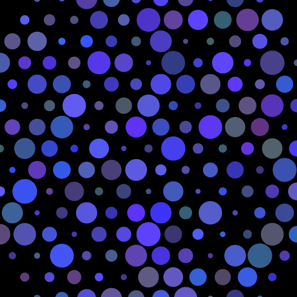
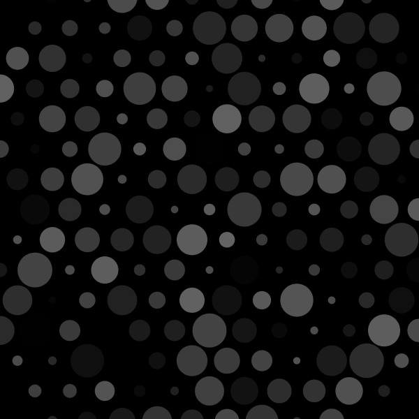
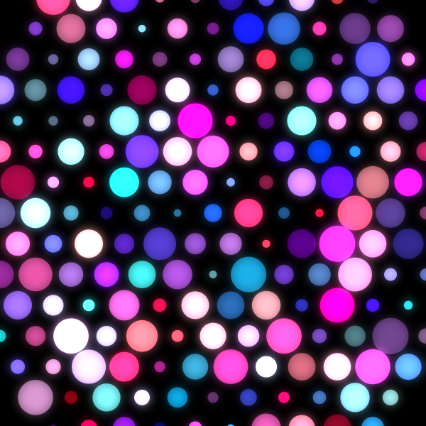
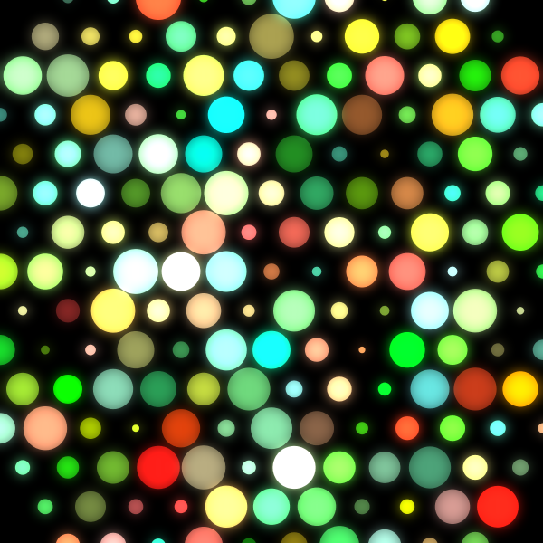
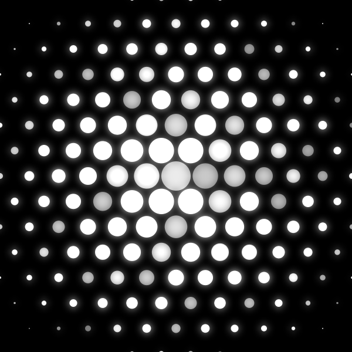
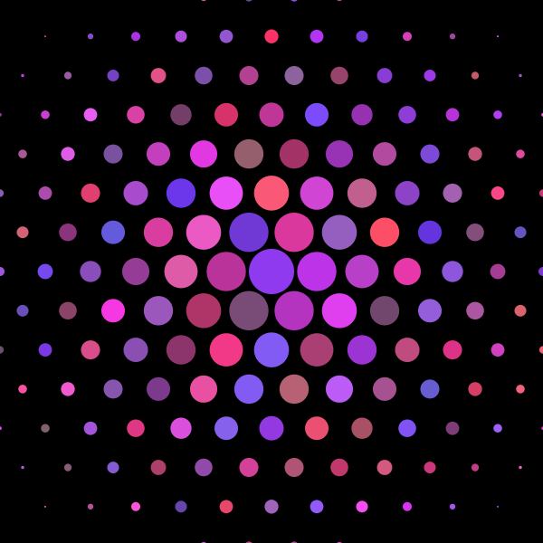
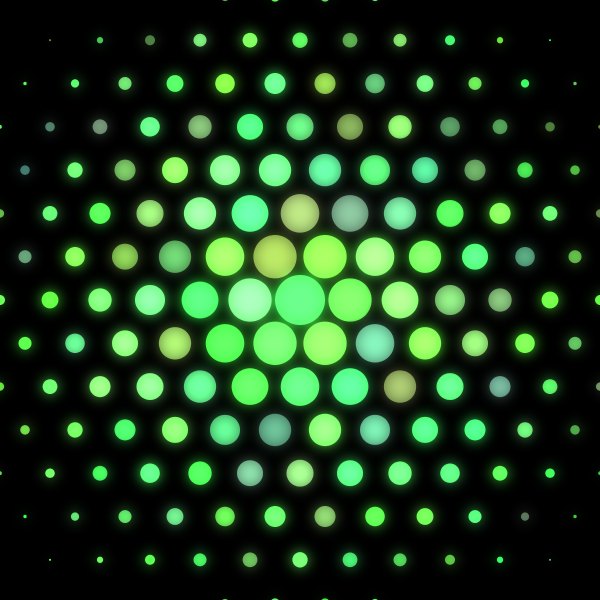

# Projects

## Colorful Bubbles

A collection of bubbles that randomly move according to the mouse position.

<iframe width="560" height="315" src="https://www.youtube.com/embed/7uNn9-0Eb1E" frameborder="0" gesture="media" allow="encrypted-media" allowfullscreen></iframe>

[Online Interactive Version](ColorfulBubbles/index.html)

[Processing Code](https://github.com/blwatkins/MiniProjects/tree/master/ColorfulBubbles)

[p5.js Code](https://github.com/blwatkins/MiniProjects/tree/master/docs/ColorfulBubbles)

## Drawing with Noise

A dynamic pseudo-mesh drawn according to the mouse's location on the screen.  The mesh is drawn by connecting the last point drawn to other new points according to the algorithm for creating a gabriel graph.  The size of the mesh is determined using perlin noise.  Keyboard interaction changes the color of the mesh and background and activates a subtle glow effect.

<iframe width="560" height="315" src="https://www.youtube.com/embed/WV9YXDzB5WY" frameborder="0" allow="accelerometer; autoplay; encrypted-media; gyroscope; picture-in-picture" allowfullscreen></iframe>

[Online Interactive Version](DrawingWithNoise/index.html)

[Java Code](https://github.com/blwatkins/MiniProjects/tree/master/DrawingWithNoise/src)

[p5.js Code](https://github.com/blwatkins/MiniProjects/tree/master/docs/DrawingWithNoise)

## Shape Rain

Random shapes appearing and fading from the screen.  The shapes can be circles, polygons, or stars, and the size of the shapes is determined by perlin noise.  Keyboard interaction changes the type and color of the shapes, as well as the background color.

<iframe width="560" height="315" src="https://www.youtube.com/embed/Dev9-FmJM_E" frameborder="0" allow="accelerometer; autoplay; encrypted-media; gyroscope; picture-in-picture" allowfullscreen></iframe>

[Online Interactive Version](ShapeRain/index.html)

[Java Code](https://github.com/blwatkins/MiniProjects/tree/master/ShapeRain/src)

[p5.js Code](https://github.com/blwatkins/MiniProjects/tree/master/docs/ShapeRain)

## Hexagon of Circles

Using a recursive method to add circles in a hexagonal pattern.  Keyboard interaction changes the size and color of the circles and can activate a glow effect.

[Java Code](https://github.com/blwatkins/MiniProjects/tree/master/HexagonOfCircles/src)

## No Overlap

Random circles that appear on the screen without overlapping.

[Java Code](https://github.com/blwatkins/MiniProjects/tree/master/NoOverlap/src)

## This Day in History

A visualization of data from [Today in History](http://history.muffinlabs.com/) with images from Wikipedia.

<iframe width="560" height="315" src="https://www.youtube.com/embed/R_a83uiELcI" frameborder="0" allow="autoplay; encrypted-media" allowfullscreen></iframe>

[Processing Code](https://github.com/blwatkins/MiniProjects/tree/master/ThisDayInHistory)
